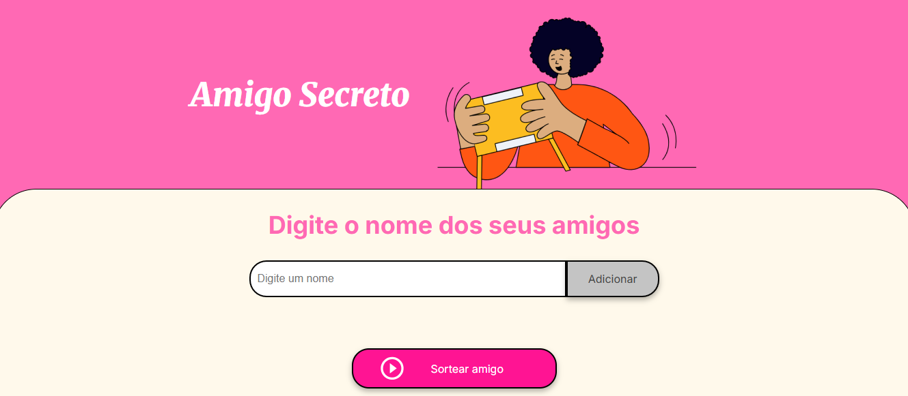

# Jogo Amigo Secreto 🎁

O **Amigo Secreto** é um projeto (challenge) desenvolvido durante meus estudos em Lógica de Programação com Java Script, dentro do contexto do programa Oracle Next Education. 

## 📸



## Tecnologias Utilizadas 👩‍💻
- **HTML5:** Para estruturas o conteúdo da página.
- **CSS3:** Para estilizar e personalizar o layout.
- **JavaScript:** Para a lógica do sorteio e manipulação dinâmica dos dados.

## Funcionalidades🚀
- **Adicionar amigos:** Você pode adicionar quantos amigos quiser para o sorteio.
- **Sorteio aleatório:** O sistema escolhe aleatoriamente um amigo para o sorteio e exibe quem foi o sorteado.

## Instalação🛠️

- Clone o repositório para sua máquina:

```bash
git clone https://github.com/Anaclauds/challenge-amigo-secreto
```
- Abra o projeto no VSCode (ou qualquer editor de sua escolha).

- Abra o arquivo index.html em um navegador de sua preferência.

## Como usar? 🎮
- **Adicionar amigos:** Digite o nome de um amigo no campo de texto e clique em ***Adicionar***.
- **Sortear amigo secreto:** Clique no botão ***Sortear amigo*** para realizar o sorteio. O nome do amigo sorteado será exibido abaixo.

## Jogue Agora! 🤩

Clique no botão abaixo para acessar o **Amigo Secreto** diretamente no seu navegador e se divertir! 🎉  

[](https://anaclauds.github.io/challenge-amigo-secreto/)


## Feito com 💖 por:
<table>
  <tr>
    <td align="center">
      <a href="https://www.linkedin.com/in/anaclaudiads/" title="Acesse meu LinkedIn">
        <br>
        <sub>
          <b>Ana Claudia Dias da Silva</b>
        </sub>
      </a>
    </td>
  </tr>
</table>
